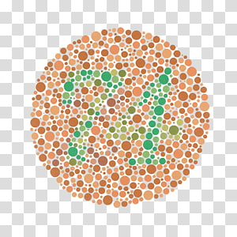
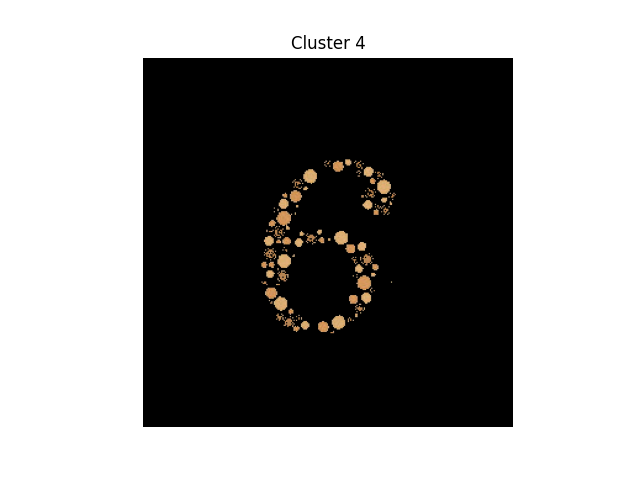
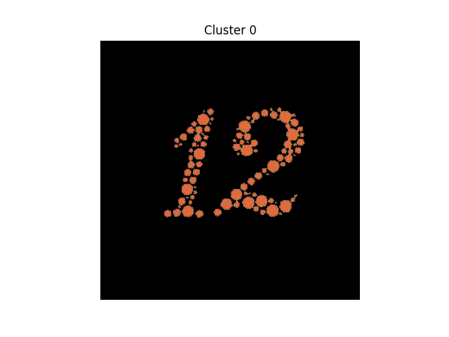
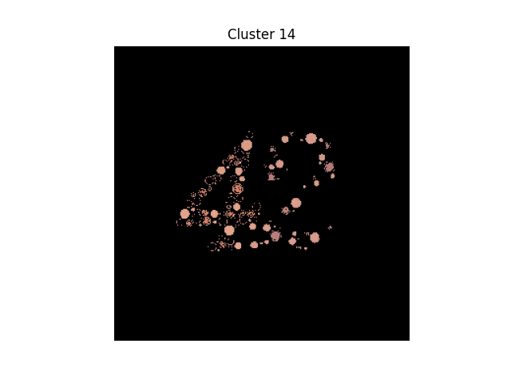
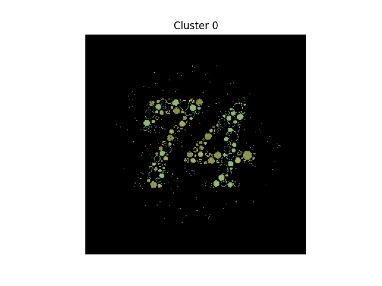

# KMeans Clustering for Image Segmentation

This project implements a custom KMeans clustering algorithm for segmenting an image into multiple clusters. The algorithm groups pixels in an image based on their color similarity, allowing for visual segmentation of different regions in the image.

---

## Features
- **Custom KMeans Implementation**: The project uses a custom implementation of the KMeans clustering algorithm without relying on external libraries like `sklearn`.
- **Image Segmentation**: The algorithm segments an image into `k` clusters based on pixel color values.
- **Visualization**: Each cluster is visualized as a separate image, highlighting the segmented regions.

---

## Requirements
To run this project, you need the following dependencies:
- Python 3.x
- OpenCV (`cv2`)
- NumPy
- Matplotlib

Install the required libraries using:
```bash
pip install numpy opencv-python matplotlib
```

---

## How It Works
1. **Load Image**: The input image is loaded from the `test-img` folder.
2. **Preprocessing**: The image is reshaped into a 2D array of pixels, where each pixel is represented by its RGB values.
3. **KMeans Clustering**:
    - Randomly initialize `k` centroids.
    - Assign each pixel to the nearest centroid based on Euclidean distance.
    - Recompute centroids as the mean of all assigned pixels.
    - Repeat until centroids stabilize or the maximum number of iterations is reached.
4. **Visualization**: Each cluster is displayed as a separate image, showing the segmented regions.

---

## Usage
1. Clone the repository:
    ```bash
    git clone https://github.com/your-repo/Kmeans-Clustering-Segmentation.git
    cd Kmeans-Clustering-Segmentation
    ```

2. Place your input image in the `test-img` folder and update the file path in the code:
    ```python
    img = cv2.imread("test-img/image.jpg")
    ```

3. Run the script:
    ```bash
    python kmean.py
    ```

4. Adjust the number of clusters (`k`) in the code:
    ```python
    kmeans = KMeansClustering(k=5)  # Change k here
    ```

---

## Results
The following images demonstrate the segmentation results for example input images from the `test-img` folder:

### Input Images


### Clustered Outputs


---

## Customization
- **Number of Clusters**: Change the value of `k` to adjust the number of clusters.
- **Image Path**: Update the file path to load a different image from the `test-img` folder:
    ```python
    img = cv2.imread("test-img/your_image.jpg")
    ```

---

## Limitations
- The algorithm may not perform well on images with high noise or very similar colors across regions.
- The number of clusters (`k`) must be chosen carefully to achieve meaningful segmentation.

---

## License
This project is licensed under the MIT License. Feel free to use and modify it for your own purposes.

---

## Acknowledgments
- OpenCV for image processing.
- NumPy for numerical computations.
- Matplotlib for visualization.
- Test images in the `test-img` folder for demonstration purposes.
